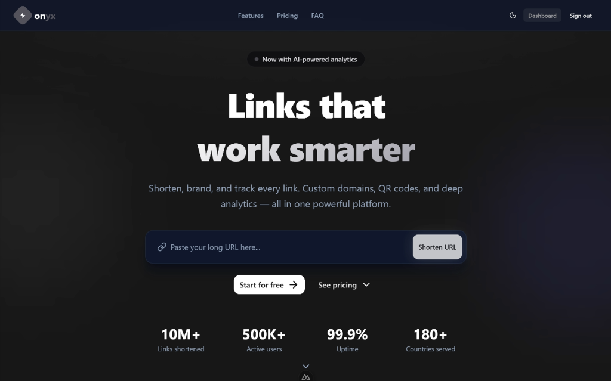
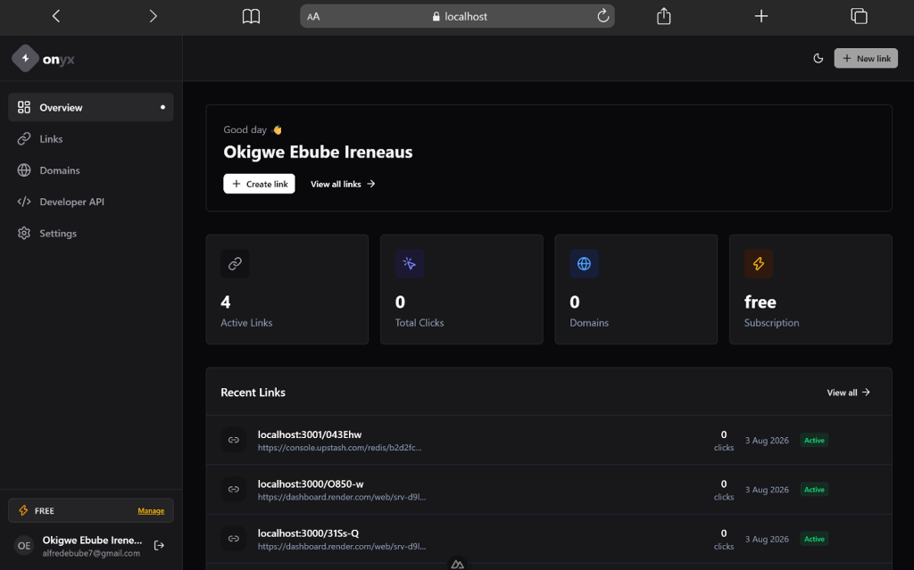
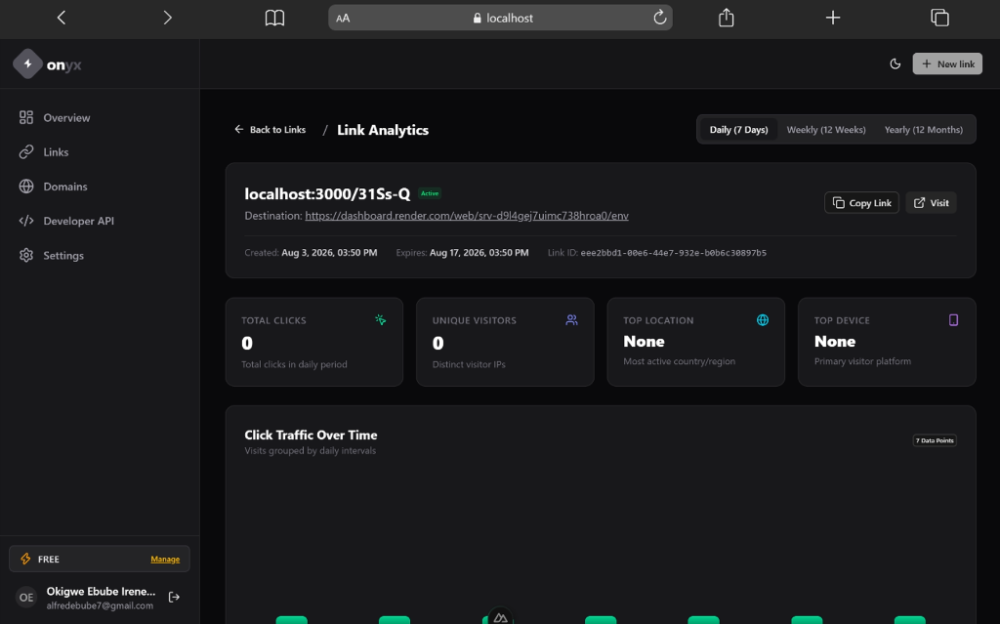
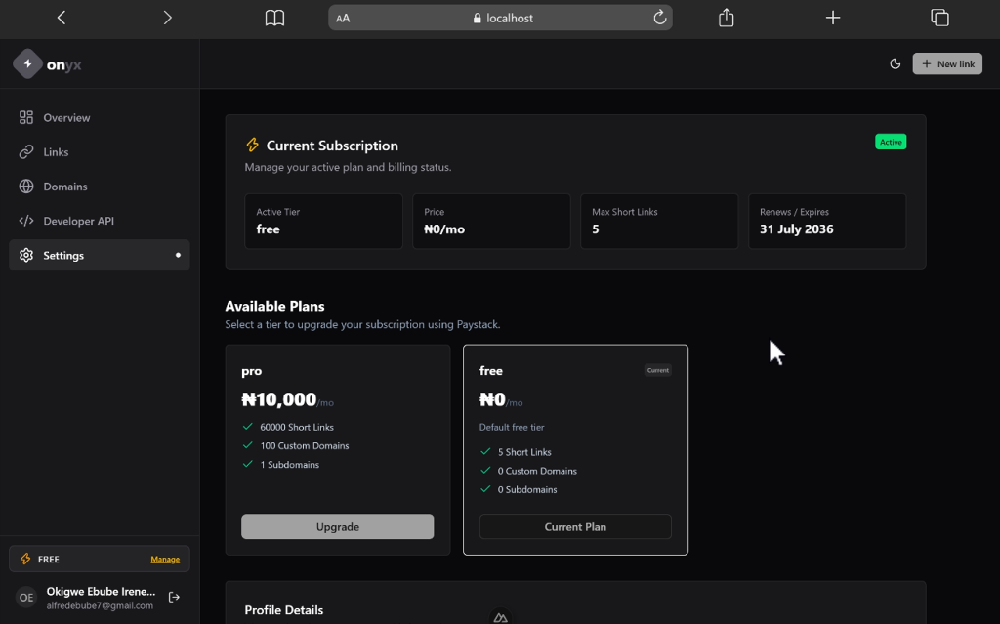
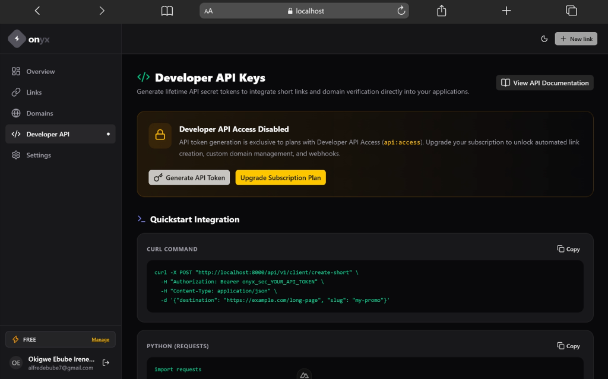
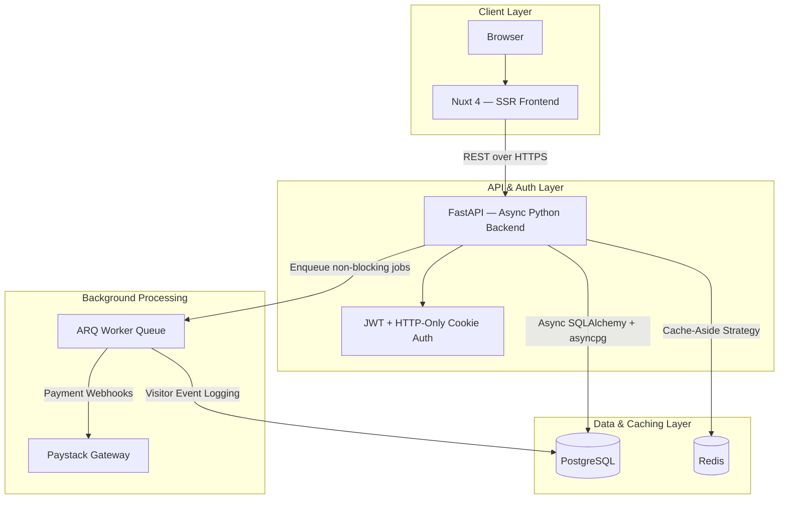

# Onyx — URL Intelligence & Custom Domain Management Platform

[](https://github.com/EbubeIreneaus/onyx/actions/workflows/ci.yml)
[](https://fastapi.tiangolo.com)
[](https://nuxt.com)
[](https://www.typescriptlang.org)
[](https://www.postgresql.org)
[](https://redis.io)
[](https://playwright.dev)
[](https://docker.com)

> A production-grade, full-stack URL management platform — featuring branded short links, custom domain routing, granular subscription tiers, QR generation, visitor analytics, and a self-healing caching layer. Engineered to demonstrate real-world system design, performance thinking, and end-to-end engineering ownership.

---

## 🌐 Live Demo

> **Live** — (https://onyx.name.ng)

---

## 📸 Application Preview

<table>
  <tr>
    <td align="center" width="50%">
      <strong>Landing Page</strong><br/>
      
    </td>
    <td align="center" width="50%">
      <strong>User Dashboard</strong><br/>
      
    </td>
  </tr>
  <tr>
    <td align="center" width="50%">
      <strong>Link Analytics</strong><br/>
      
    </td>
    <td align="center" width="50%">
      <strong>Subscription Management</strong><br/>
      
    </td>
  </tr>
  <tr>
    <td align="center" colspan="2">
      <strong>Developer API</strong><br/>
      
    </td>
  </tr>
</table>

---

## What This Project Demonstrates

This is not a tutorial project. Every architectural decision here was made intentionally, with production constraints in mind — throughput, correctness, security, and maintainability.

- **Full-stack ownership** — from database schema design and async API engineering to SSR frontend, permission systems, and CI pipelines
- **Performance-aware design** — asynchronous I/O throughout, Redis cache-aside with proactive invalidation, and background job delegation to keep API latency minimal
- **Security depth** — JWT authentication, role-based access control, domain-scoped path reservation, and system subdomain protection
- **Engineering discipline** — zero-error linting and typechecking, Playwright E2E test coverage, and automated CI on every push

---

## System Architecture

The system is structured as a decoupled monorepo. The API layer is fully async, the frontend is SSR-rendered, and background work is delegated to a Redis-backed job queue — keeping every HTTP response lean and non-blocking.



---

## Engineering Highlights

### Async-First Architecture
The entire backend is built on non-blocking I/O — FastAPI with async route handlers, SQLAlchemy 2.0 async engine, and asyncpg connection pooling. No synchronous database calls exist on any hot path. Long-running side effects (webhook processing, visitor logging, email dispatch) are delegated to an ARQ worker queue backed by Redis, keeping HTTP response times consistently fast under concurrent load.

### Intelligent Cache Invalidation
Public pricing data is served through a Redis cache-aside layer. The cache is populated lazily on first request and invalidated immediately — not on a TTL — whenever an administrator mutates a subscription tier. This guarantees consistency without polling, and eliminates redundant database queries for high-traffic public endpoints.

### Domain-Scoped Path Reservation Engine
One of the more nuanced systems in this codebase: when users create custom short links, the slug they choose must not collide with the application's own reserved routes (dashboards, admin panels, auth pages, and their sub-paths). The challenge is that this rule should only apply when the link targets the primary application domain — if a user brings their own domain, they can use any slug freely.

This required building a context-aware validation engine that runs identically on both the Python API and the TypeScript frontend, ensuring the rules are enforced at every entry point without duplication of business logic.

### Capability-Based Subscription & RBAC System
Subscription plans are not just database records — each tier is associated with a precise set of feature capabilities. Access to features (analytics, custom slugs, subdomains, API keys, SDKs, QR generation) is checked against a user's active plan at the API layer. The frontend pricing page fetches and renders this permission matrix dynamically from the database, so plan changes reflect immediately without a frontend deployment.

### System Domain Protection
The platform allows users to register custom domains for branded short links. A deliberate constraint prevents users from registering the application's own domain or any of its system-level subdomains — preventing privilege escalation through domain registration.

### End-to-End Test Coverage
E2E tests are written in Playwright, covering stateful user flows including authentication (signup → session → protected route access). The test suite uses API route interception to simulate server state, removing dependency on a live backend during CI. All tests run headlessly against a dev server that is spun up automatically in the pipeline.

### CI/CD Pipeline
GitHub Actions runs the full quality gate on every push and pull request:
- ESLint and Vue TypeScript checking — zero warnings tolerated
- Pytest async test suite across auth and admin flows
- Playwright end-to-end browser tests

---

## Technology Stack

| Domain | Technologies |
| :--- | :--- |
| **Frontend** | Nuxt 4, Vue 3 (Composition API), TypeScript, Tailwind CSS v4, Nuxt UI v3 |
| **Backend** | Python 3.12, FastAPI, SQLAlchemy 2.0 (Async), Alembic, Pydantic v2 |
| **Data Layer** | PostgreSQL 16, Redis 7, asyncpg, aioredis, ARQ |
| **Auth & Security** | PyJWT, Argon2/bcrypt via Passlib, HTTP-Only Cookies, CORS, Route Guarding |
| **Testing** | Playwright, Pytest, pytest-asyncio, Nuxt ESLint, vue-tsc |
| **Infrastructure** | Docker, Docker Compose, GitHub Actions |

---

## Getting Started

### One command (Docker)

```bash
git clone https://github.com/EbubeIreneaus/onyx.git
cd onyx
docker compose up --build
```

### Manual setup

**Backend**
```bash
cd api
pip install uv && uv sync
uv run alembic upgrade head
uv run uvicorn main:app --reload --port 8000
```

**Frontend**
```bash
cd web
pnpm install
pnpm run dev
```

---

## Running Tests

```bash
# Python — unit & integration
cd api && uv run pytest tests/ -q

# TypeScript — lint + typecheck
cd web && pnpm run lint && pnpm run typecheck

# Playwright — E2E browser tests
cd web && pnpm run test:e2e
```

---

## Project Layout

```
onyx/
├── .github/workflows/     # CI pipeline definitions
├── docs/screenshots/      # Application screenshots
├── api/
│   ├── libs/              # Shared utilities — caching, auth, route guards, permission helpers
│   ├── models/            # SQLAlchemy ORM models
│   ├── routers/v1/        # Versioned API routes (auth, client, admin, webhooks)
│   ├── schemas/           # Pydantic request/response schemas
│   ├── workers/           # ARQ async background task definitions
│   └── tests/             # Pytest test suite
└── web/
    ├── app/
    │   ├── components/    # Reusable UI components
    │   ├── composables/   # Vue composables — auth, links, domains, API
    │   ├── layouts/       # Route layout wrappers
    │   ├── libs/          # Permission helpers, route reservation engine
    │   └── pages/         # Application routes
    └── tests/             # Playwright E2E specs
```

---

## Author

**Ebube Ireneaus** — Full-Stack Engineer
- GitHub: [@EbubeIreneaus](https://github.com/EbubeIreneaus)
- Docker Hub: [ebubeireneaus](https://hub.docker.com/u/ebubeireneaus)
